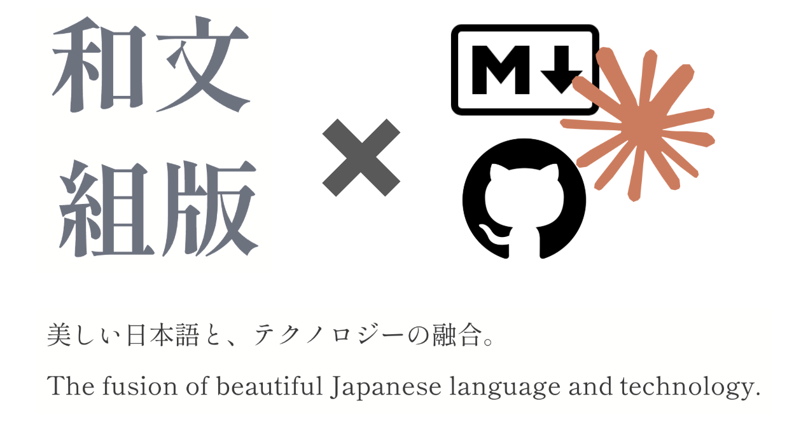

# 言語化

## 事業性

現時点では収益度外視の個人プロダクトとして開発する。自分自身がユーザーであり、設計判断の基準は自分が毎日使いたいかどうか。公開後にユーザーが集まれば、データ同期・AI利用などが自然な課金ポイントになりうる（Obsidianモデル）。

## コンセプト

自分だけの書斎。和文組版とテクノロジーで生み出される、執筆に集中するためのエディター。



書斎とは心の居場所。都会の喧騒の中、賑やかなカフェの中、木々の戦ぐ山の中。どんな場所でも変わらずそこにある。情緒と実用が混ざり合って、誰かにとっての「良い道具」になる。

※stoneというエディターの方向性をベースに、クロスプラットフォームやAIなどの実用性を付加する。また、stoneがOSSであることから、そのリスペクトを込めてフロントエンドのリポジトリを公開する。

## ターゲット

AI・Git・Markdownなどの技術に親しみがあって、ブログやエッセイなど日本語で長文を書く人。

## マーケティング

どういうコミュニティの目に触れさせるのか？

## 価値

書斎としての価値を以下のように定義し、それを機能として実現する。要素を象徴する存在を定義することで、プロダクトのあり方を明確に定める。

- **戸(と)**: 外界のノイズから切り離された集中できる環境
  - 認知コストの低いUI
- **筆(ふで)**: 自分だけにカスタムされたお気に入りの道具
  - 和文組版
  - UIの完全カスタム要素
- **栞(しおり)**: 昨日と変わらない状態で迎えてくれる居場所
  - 全デバイスで作業環境を永続化
  - クロスプラットフォーム(アプリを開けばすぐそこに)
- **棚(たな)**: 蓄積・活用できる状態にあるこれまでの情報
  - AIエージェント
  - Git連携
  - 投稿機能(NoteやZennなど)

## 課金

既存エディターは買い切り型で、「執筆を体験してから購入検討をする」という自然な購買行動が実現できない。そこで、フリーミアムを導入し、まずは体験してもらうことを重視する。

## 和文組版について

### 概要

和文組版とは、日本語の文章を美しく読みやすく配置するための技術体系。JIS X 4051で規定されている。

### 禁則処理

行の頭や末尾に置いてはいけない文字のルール。

- **行頭禁則**: 句読点（。、）、閉じカッコ（」』）】〉）、？！、長音（ー）、小書き（っゃゅょ）、…― などは行頭に置けない
- **行末禁則**: 開きカッコ（「『（【〈）などは行末に置けない
- **分離禁則**: 三点リーダー（……）、ダッシュ（——）、小数（3.14）、桁区切り（1,000）、単位付き数値（5kg）などは途中で改行できない

### 字間

- **ベタ組み**: 全文字を全角等幅で並べる。本文の基本。安定した読みやすさ
- **ツメ組み**: 文字ごとの字幅を考慮しプロポーショナルに詰める。見出し・タイトル向け

### 約物のアキ処理

和文組版で最も複雑な部分。約物（句読点・カッコ等）は半角幅の文字だが、前後にアキ（余白）を持って全角扱いになる。

```
約物の文字幅（二分）＋ アキ（二分）＝ 全角

例:「文章」
  「 → 文字幅半角 ＋ 後ろに半角アキ = 全角
  」 → 前に半角アキ ＋ 文字幅半角 = 全角
```

約物が連続する場合（」「 や 。」）はアキが重複するため詰める:

```
✕: ○○」　「○○  （アキが全角分空く）
○: ○○」「○○    （二分詰め）
```

### 禁則の調整方法

- **追い込み**: 前の行の約物のアキを詰めて、禁則文字を前の行に収める
- **追い出し**: 行末の1字を次の行に送り、字間を均等に広げて調整

### Web実装上の注意

CSSの `word-break`、`line-break`、`overflow-wrap` で部分的に制御できるが、約物のアキ処理（二分詰め等）はCSSだけでは不完全。本格的な和文組版にはJavaScriptでの文字間制御か、専用エンジンが必要。
